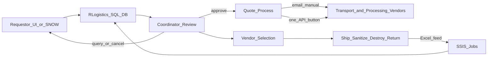

# RLogistics As-Is Reverse Logistics Flow

## Overview

Acme Bank team members create **asset disposal requests** through:

- **RLogistics UI**, or
- **Partner systems** such as ServiceNow (via RLogistics API)

All requests land in the **RLogistics SQL DB** and can be reviewed by **coordinators**.

## Coordinator review

Coordinators review each request and may:

- Reach back to requestors with queries (missing/incorrect details)
- Process the request if details are good
- Cancel in extreme scenarios

## Vendor selection (quote process)

After review, coordinators select:

- **Transportation vendors** — ship devices from point A to B
- **Processing vendors** — destroy or sanitize assets and return devices to Acme Bank

Selection happens through a **quote process**:

1. From RLogistics, coordinators can ask for a quote
2. RLogistics sends email RFQs to vendors
3. Responses are accessed **manually via email** by coordinators
4. One vendor exposes quotes via **API** (accessed on button click per request)

## Status updates

Vendors send status back via **Excel feed**. Updates enter RLogistics through **SSIS jobs**.

## Flow diagram

## Pain points

- Incomplete requests causing coordinator bounce-backs
- Manual coordinator triage and tribal knowledge
- Email-based quoting (manual inbox work)
- Excel/SSIS status ingestion fragility
- Vendor selection not systematically data-backed
